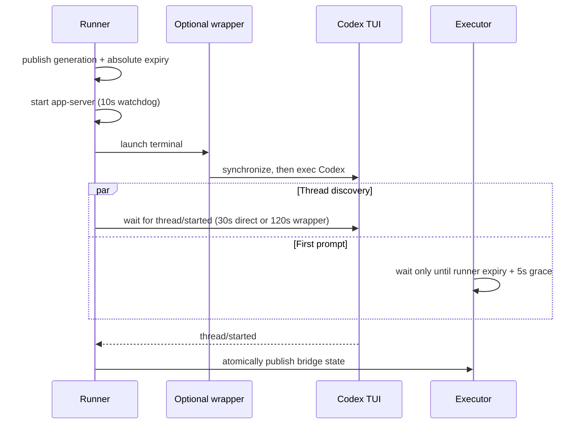

# Codex native managed startup

## Problem

A managed Codex session can launch its TUI through a configured command
wrapper. The wrapper may synchronize its own runtime before it `exec`s Codex.
In a captured cold launch, `thread/started` arrived after about 34 seconds, so
the forwarder's ordinary 30-second watchdog reported that the Codex native
thread never started even though the wrapper was still making progress.

The timeout was only one part of the failure mode. The runner and the executor
used independent wait windows, and failed launches did not consistently retract
the exact app-server, terminal, router, and bridge generation they created. A
late cleanup could therefore race a replacement launch, while a prompt arriving
late could manufacture a fresh wait window after the original launch had
already expired.

Increasing every timeout would hide fast failures and blur component
boundaries. The managed path instead uses layered watchdogs and explicit
generation ownership.

## Existing watchdogs

| Budget | Owner | Contract |
| --- | --- | --- |
| 10s | Codex app-server | Detect a process or socket that never becomes ready. |
| 15s | Local `omnigent codex` CLI | Bound local TUI thread discovery. |
| 30s | Ordinary forwarder | Bound direct TUI `thread/started` discovery. |
| 60s | Executor compatibility path | Wait for bridge state when no managed-startup claim exists. |
| Unbounded | Interactive login recovery | Continue listening only after an actionable sign-in error is already visible. |

Those budgets keep their existing meanings. In particular, the managed
transaction ceiling does not turn the app-server's 10-second liveness probe
into a multi-minute wait.

## Proposed contract

The runner owns one managed-startup transaction:

```text
effective phase wait = min(phase watchdog, overall time remaining)
```

- The provisional overall ceiling is 180 seconds.
- A configured command wrapper gets a 120-second `thread/started` phase
  watchdog because the wrapper performs work before Codex exists.
- A direct managed Codex launch keeps the forwarder's 30-second default.
- Component-owned timeouts remain nested inside the ceiling and keep their own
  errors.
- Interactive login recovery remains unbounded after publishing the sign-in
  error; it is no longer part of startup liveness from the turn's perspective.

The 120-second phase cap and 180-second ceiling are deliberately separate and
provisional. The phase cap is long enough to cover the observed cold wrapper
launch with margin, while the larger ceiling also bounds the surrounding
app-server, terminal, and relay setup. Production cold-start distributions
should inform future tuning.

## Cross-process startup claim

The runner writes an atomic `startup.json` claim in the bridge directory with:

- an opaque generation;
- wall-clock start and absolute expiry timestamps;
- the current named startup stage and its update timestamp.

The runner enforces the ceiling with its monotonic clock. The wall-clock expiry
is only a cross-process rendezvous contract for the executor. An executor that
starts late waits only until that existing expiry plus a five-second publication
grace; it does not start another multi-minute lease. An executor with no claim
keeps the legacy 60-second behavior.



## Ownership and rollback invariants

Each bridge-state write, startup-error write, and rollback verifies the active
generation while holding the bridge lock. Each registry cleanup similarly
verifies the exact app-server or terminal instance. Subagent and turn-router
adoption transfers generation ownership under each router registry's lifecycle
lock, and teardown compares that owner under the same lock. Therefore:

1. A predecessor cannot overwrite a successor's state or error.
2. A predecessor cannot close a successor's app-server or terminal.
3. Cancellation is handled like any other failed startup.
4. A failed startup retracts only resources it created and preserves its
   actionable error for the executor.
5. Once bridge state is published, startup has succeeded. Later forwarder
   shutdown closes forwarder-owned connections but does not retract the live
   terminal as if startup had failed.

## Verification boundaries

Regression tests pin all pre-existing timeout values, phase-versus-overall
error attribution, absolute-expiry behavior, cancellation cleanup,
generation-safe state and error publication, successor preservation, and the
post-start forwarder lifecycle.

This change does not alter server HTTP request timeouts, redesign forwarder
recovery, change Codex app-server readiness behavior, or add an asynchronous
startup-progress protocol. Those are separate contracts and should be changed
only with their own end-to-end evidence.
